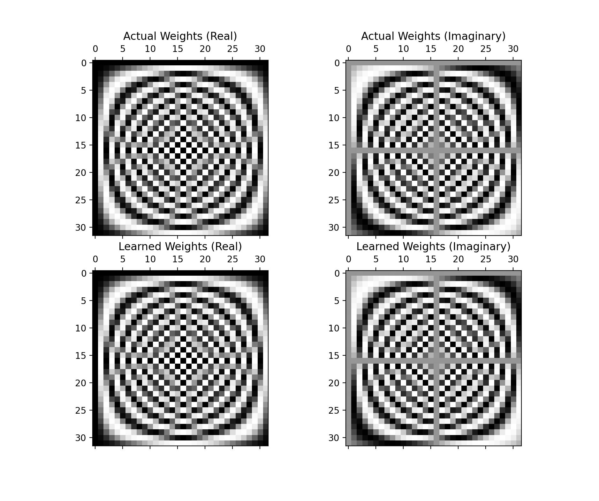

A basic pytorch model that learns an N-point DFT matrix. Since the DFT is linear, the model just needs to learn a linear function, so the model consists of a single linear layer. To setup the environment, run the following commands.

1. `python3 -m venv env`
2. `source env/bin/activate`
3. `pip install -r requirements.txt`
4. `python main.py`

A few different parameters can be set using the command line. Run `python main.py -h` to see which parameters can be set.

The model produces weights that are extremely similar to the real DFT matrix (MSE on the order of 1e-9). An example of an actual and learned 32 point DFT matrix is shown below.

